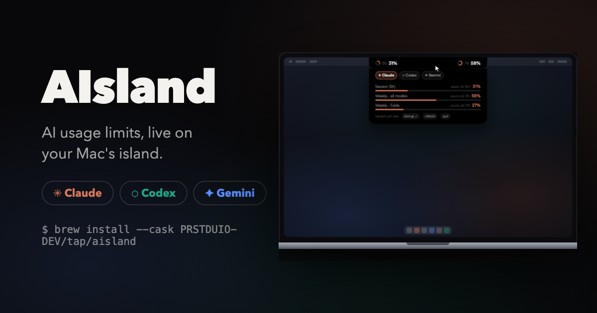
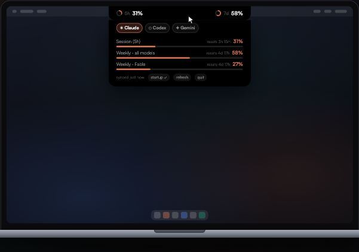
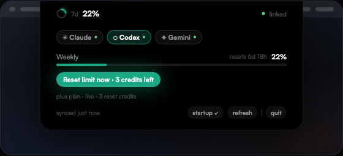

# AIsland

<p align="center">
  
</p>

<p align="center">
  <a href="https://github.com/PRSTDUIO-DEV/AIsland/releases"></a>
  
  
  <a href="LICENSE"></a>
</p>

Dynamic Island–style usage meter for AI coding CLIs (Claude / Codex / Gemini),
pinned to the MacBook notch (falls back to a floating top-center pill on
screens without a notch).

**[▶ Interactive presentation](https://prstduio-dev.github.io/AIsland/)**

## Screenshots

| Hover the island | Reset Codex limits |
|:---:|:---:|
|  |  |
| Live bars, ticking reset countdowns, your plan | One-click use of OpenAI's granted reset credits |

**Providers**

| Provider | Data | Auth |
|----------|------|------|
| Claude | Session 5h / Weekly / per-model limits, live from the OAuth usage API | auto from Claude Code's Keychain entry |
| Codex | Live rate-limit windows from the same API the Codex CLI uses (session-log fallback) + manual reset-credit button | auto from `~/.codex/auth.json`; "Connect" runs `codex login` |
| Gemini | auth status only (no public usage API) | auto from `~/.gemini/oauth_creds.json`; "Connect" runs the Gemini CLI login |

**Install**

```bash
# Homebrew
brew install --cask PRSTDUIO-DEV/tap/aisland
xattr -dr com.apple.quarantine /Applications/AIsland.app

# or download the DMG from Releases and drag AIsland.app to Applications
```

The app is ad-hoc signed (not notarized). If macOS blocks it: right-click → Open,
or `xattr -dr com.apple.quarantine /Applications/AIsland.app`.

**Build from source**

```bash
./build.sh run        # dev build + launch
./release.sh 1.0.0    # universal binary + DMG in dist/
```

- Hover the pill → expands with provider tabs, usage bars, reset countdowns.
- Click a provider chip to pin it to the collapsed pill (persisted).
- Footer: `startup` toggles launch-at-login, `refresh`, `quit`.
- Data auto-refreshes every 60s, on hover (throttled to 30s), and after wake from sleep.

First launch: macOS will ask once for Keychain access to the Claude Code
credential — click **Always Allow**.

**Update**: `brew update && brew upgrade --cask aisland` (DMG users: re-download
from Releases). A menu-bar gauge icon mirrors everything — usage summary,
refresh, launch-at-login, quit — for keyboard and assistive-tech access.

**License**: [MIT](LICENSE)
